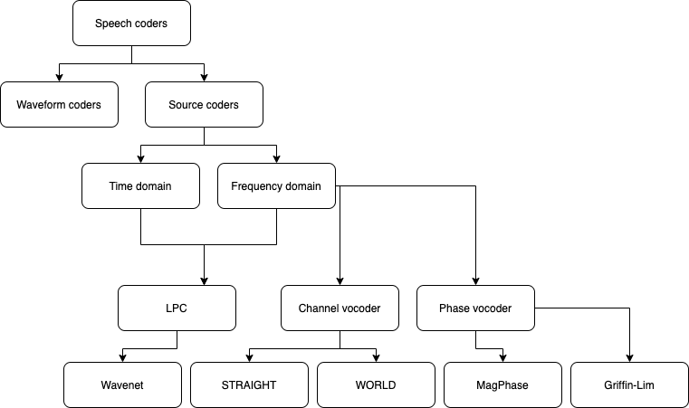

# Vocoders-state-of-the-art

This github page contains all the Vocoding methods we tested for both Icelandic and English.

- Mixed-Excitation-Based Vocoders 
  - Channel vocoder
   - STRAIGHT
   - WORLD 
  - Phase vocoder 
  - Griffin-Lim
  - MagPhase
- Neural Vocoders
  - WaveNet
  - LPCNet
- Glottal-Excitation-Based Vocoders 
- Sinusoidal Vocoders 

_Coprehensive taxonomy of speech coders based on different vocoding schemes._
